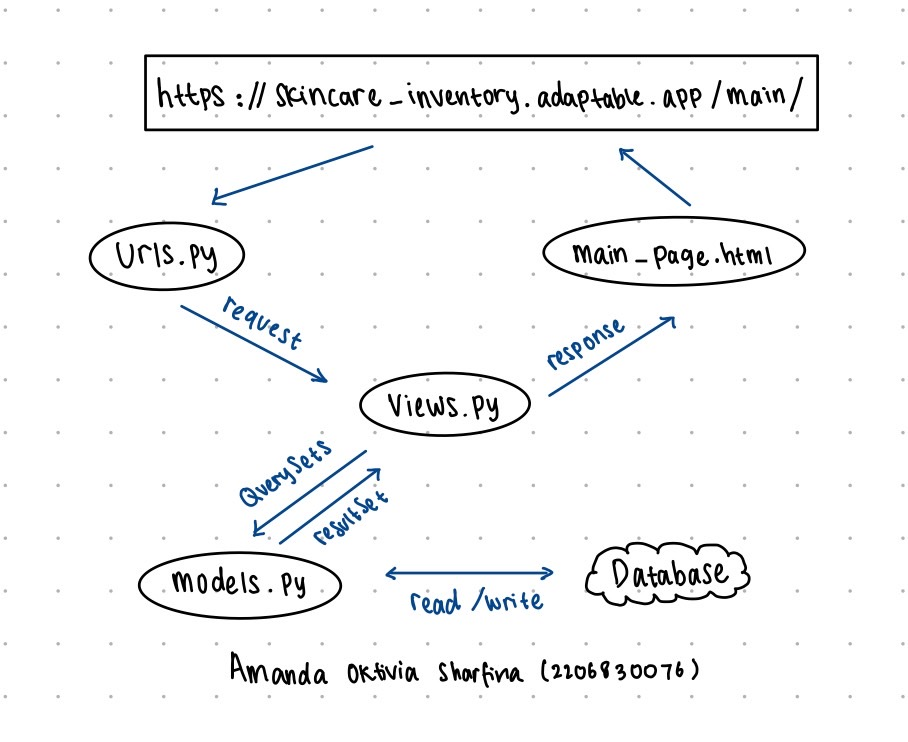
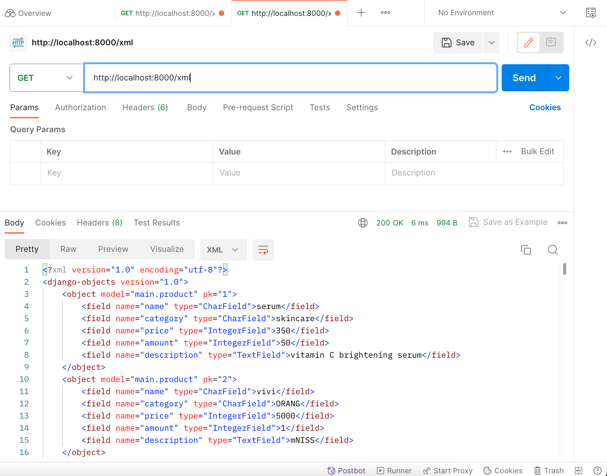
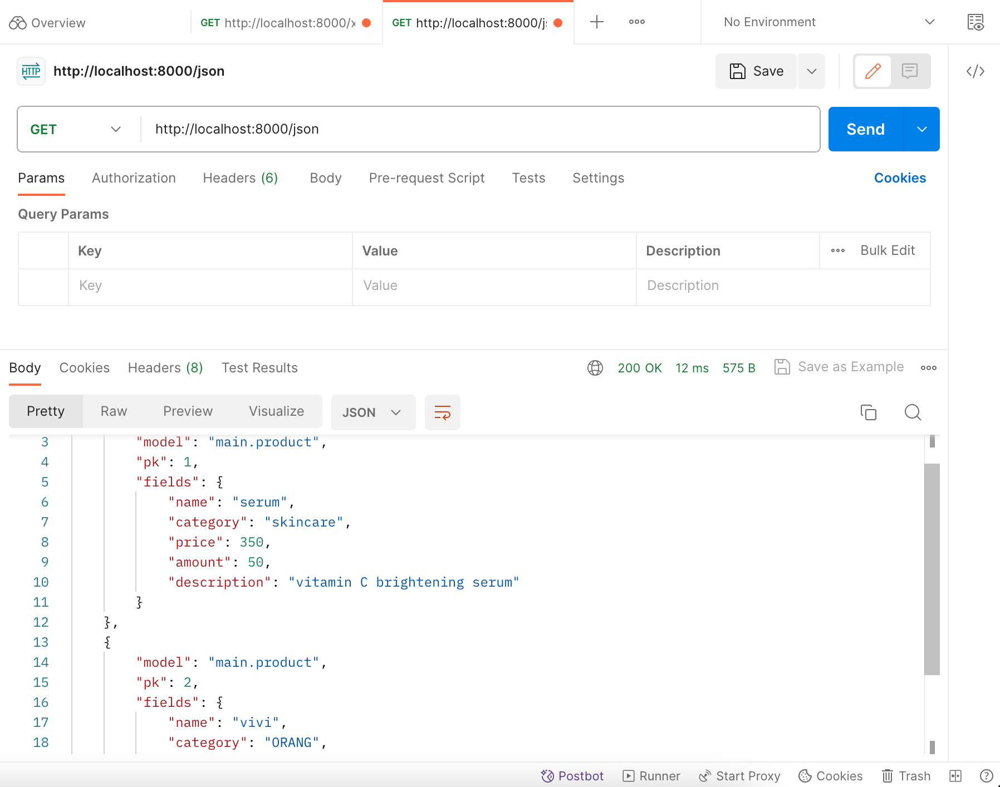
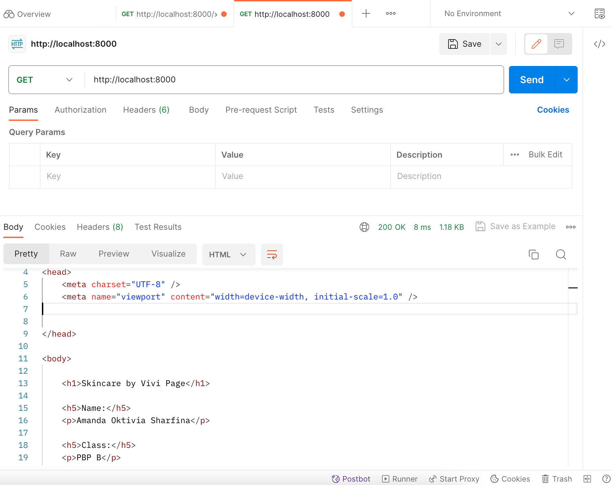

# Skincare Inventory
`Amanda Oktivia Sharfina 2206830076
PBP B`

## Tugas 2
>1. Jelaskan bagaimana cara kamu mengimplementasikan checklist di atas secara step-by-step (bukan hanya sekadar mengikuti tutorial).

 - [x] Membuat sebuah proyek Django baru.

 Pada langkah awal, saya membuat direktori lokal baru dan juga repositori GitHub baru. Selanjutnya, saya menghubungkan repositori lokal dengan repositori di GitHub dengan perintah "git branch -M main" untuk menciptakan branch utama, dan menggunakan perintah "git remote add origin <URL_REPO>" untuk mengaitkan repositori lokal dengan repositori di GitHub.

Kemudian, saya membuat lingkungan virtual dengan menjalankan perintah "python -m venv env" dan mengaktifkannya dengan perintah "source env/bin/activate". Dalam keadaan lingkungan virtual yang aktif, saya menambahkan file "requirements.txt" sebagai daftar dependensi yang akan digunakan dalam proyek ini. Saya menginstal semua dependensi dari file "requirements.txt" dengan perintah "pip install -r requirements.txt".

Setelah itu, saya membuat proyek Django baru dengan nama "skincare-inventory" dengan menjalankan perintah "django-admin startproject skincare_inventory ..".

Langkah selanjutnya adalah mengonfigurasi proyek dengan menambahkan tanda bintang (*) pada variabel "ALLOWED_HOSTS" di file "settings.py" untuk memberikan izin akses kepada semua host.

 - [x]  Membuat aplikasi dengan nama `main` pada proyek tersebut.

Pada langkah ini, saya menginisialisasi struktur inti proyek dengan menambahkan direktori "main" ke dalam repositori proyek menggunakan perintah "python3 manage.py startapp main". Selanjutnya, saya memasukkan folder "main" ke dalam daftar aplikasi yang terdaftar dalam variabel "INSTALLED_APPS" di dalam file "settings.py" untuk mendaftarkannya ke dalam proyek.

 - [x] Melakukan *routing* pada proyek agar dapat menjalankan aplikasi `main`.

Saya sebagai developer akan mulai mendefinisikan rute URL aplikasi utama dengan menambahkan path ke dalam variabel urlpatterns pada file urls.py. Path tersebut akan terdiri dari informasi tentang route, function yang ada di dalam file views.py, dan juga parameter name. Selanjutnya, saya akan mengonfigurasi routing URL proyek dengan menambahkan path yang mencakup route dan fungsi include ke dalam variabel urlpatterns. Fungsi include ini sangat berguna karena memungkinkan saya untuk mengimpor rute URL dari aplikasi main ke dalam file urls.py proyek, sehingga proyek ini dapat berjalan dengan baik.

 - [x] Membuat model pada aplikasi `main` dengan nama `Item` dan memiliki atribut wajib sebagai berikut.
    + `name` sebagai nama *item* dengan tipe `CharField`.
    + `category` sebagai kategori *item* dengan tipe `CharField`.
    + `price` sebagai harga *item* dengan tipe `IntegerField`.
    + `amount` sebagai jumlah *item* dengan tipe `IntegerField`.
    + `description` sebagai deskripsi *item* dengan tipe `TextField`.
        Saya sebagai developer, membuat model yang berisi beberapa atribut bersama dengan atribut tambahan. Salah satunya adalah atribut "category" yang digunakan sebagai kategori item dengan tipe data CharField, atribut "price" yang berfungsi sebagai harga item dengan tipe data IntegerField, dan lain-lain. Setelah saya berhasil mendefinisikan semua atribut model tersebut, langkah selanjutnya adalah melakukan migrasi model ke dalam database. Untuk melakukannya, saya menjalankan perintah "python3 manage.py makemigrations" untuk membuat file migrasi yang diperlukan. Setelah file migrasi tersebut dibuat, langkah terakhir adalah menerapkannya ke dalam database dengan menjalankan perintah "python3 manage.py migrate."

 - [x] Membuat sebuah fungsi pada `views.py` untuk dikembalikan ke dalam sebuah *template* HTML yang menampilkan nama aplikasi serta nama dan kelas kamu.

    Saya sebagai developer pertama-tama mengimpor fungsi "render" dari modul "django.shortcuts" untuk digunakan dalam proses rendering tampilan "main_page.html". Selanjutnya, mendefinisikan fungsi "show_app_name" dengan parameter "request". Tujuan dari fungsi ini adalah untuk mengatur permintaan HTTP dan menghasilkan tampilan yang sesuai dengan permintaan tersebut.

    Setelah itu, lanjutkan dengan menambahkan data seperti "app_name", "name", dan "class" ke dalam konteks yang ada dalam fungsi "show_app_name". Konteks ini akan digunakan untuk mengirimkan data ke tampilan HTML yang akan ditampilkan.

    Langkah terakhir, saya menggunakan perintah "return render(request, "main_page.html", context)" untuk menampilkan tampilan HTML di web server. Dengan cara ini, saya memastikan bahwa halaman "main_page.html" akan dirender dengan benar sesuai dengan konteks yang telah saya tentukan sebelumnya.

 - [x] Membuat sebuah *routing* pada `urls.py` aplikasi `main` untuk memetakan fungsi yang telah dibuat pada `views.py`.

    Pada langkah awal, saya sebagai developer mengawali dengan mengimpor modul "path" dari "django.urls" serta fungsi "show_app_name" dari berkas "views.py". Kemudian, saya memberikan sebuah label "app_name" yang saya namakan "main" untuk memberikan identitas yang unik pada pola URL dalam aplikasi ini. Setelah itu, langkah berikutnya adalah menambahkan path ke dalam variabel "urlpatterns", yang mencakup informasi mengenai rute, fungsi "show_app_name", dan parameter "name".

 - [x] Melakukan *deployment* ke Adaptable terhadap aplikasi yang sudah dibuat sehingga nantinya dapat diakses oleh teman-temanmu melalui Internet.

    Setelah semua poin dalam checklist telah selesai, developer melakukan push semua perubahan yang telah dibuat ke dalam GitHub. Pertama, developer menjalankan perintah git add . untuk mengambil seluruh perubahan yang belum di-stage. Kemudian developer menjalankan perintah git commit -m "<komentar>" dan git push -u origin main. Setelah berhasil melakukan push semua perubahan ke repositori GitHub,lanjutkan dengan proses deploy aplikasi menggunakan layanan Adapatable.io. Saya menggunakan repositori GitHub proyek "skincare_inventory" dan branch "main." Selanjutnya, saya memilih Python App Template dan mengkonfigurasi PostgreSQL sebagai database yang akan digunakan. Saya juga menyesuaikan versi Python yang akan digunakan di dalam lingkungan virtual, yaitu versi 3.11. menetapkan perintah python manage.py migrate && gunicorn skincare_inventory_App.wsgi pada bagian start command, memasukkan nama aplikasi, yaitu skincare_inventory, mencentang opsi HTTP Listener on PORT, dan klik Deploy.

>2. Buatlah bagan yang berisi request client ke web aplikasi berbasis Django beserta responnya dan jelaskan pada bagan tersebut kaitan antara urls.py, views.py, models.py, dan berkas html.

    

>3. Jelaskan mengapa kita menggunakan virtual environment? Apakah kita tetap dapat membuat aplikasi web berbasis Django tanpa menggunakan virtual environment?

    Kita memanfaatkan virtual environment untuk mengatur dan membatasi dependensi yang diperlukan oleh proyek Python agar terisolasi. Dependensi ini merujuk kepada komponen-komponen atau modul-modul yang diperlukan oleh perangkat lunak, seperti library, framework, atau package tertentu. Setiap proyek biasanya memiliki spesifikasi yang unik. Salah satu keuntungan utama adalah kita dapat menginstal versi-dependensi yang sesuai dengan kebutuhan proyek dalam virtual environment tertentu tanpa mempengaruhi instalasi Python global pada sistem.

    Pemanfaatan virtual environment memiliki kepentingan signifikan dan memberi berbagai keuntungan, seperti kemudahan dalam manajemen, stabilitas, portabilitas, dan isolasi. Meskipun demikian, membangun aplikasi web berbasis Django masih memungkinkan tanpa menggunakan virtual environment. Namun, ada beberapa aspek yang perlu diperhatikan agar dapat menghindari potensi masalah. Jika Anda menginstal paket yang sama untuk dua aplikasi web Django berbeda, mungkin akan muncul konflik paket. Selain itu, ketika Anda ingin mendeploy aplikasi web Django ke server, Anda harus memastikan bahwa semua paket yang dibutuhkan telah terpasang di server tersebut. Inti dari permasalahan ini terletak pada keberadaan berkas requirements.txt. Ketika Anda sudah menginisialisasi lingkungan virtual, requirements.txt menjadi alat yang sangat berguna bagi penyedia layanan hosting untuk mengelola dan menjalankan aplikasi Django dengan lebih efisien, aman, dan konsisten dalam lingkungan hosting.

>4. Jelaskan apakah itu MVC, MVT, MVVM dan perbedaan dari ketiganya.

        + Arsitektur desain Model View Controller memecah kode menjadi tiga bagian utama: Model, View, dan Controller.

            Model: Bagian ini berisi logika bisnis untuk mengambil dan mengelola data, berkomunikasi dengan pengontrol, berinteraksi dengan database, dan melakukan pembaruan terhadap tampilan.

            View: User Interface mengandung elemen-elemen seperti HTML, CSS, dan XML. Terkadang, tampilan berinteraksi dengan pengontrol dan terkadang juga berhubungan dengan model. Melalui pengontrol, data dinamis kadang-kadang melewati beberapa tampilan.

            Controller: Komponen ini sering kali dikenal sebagai Aktivitas atau Fragmen. Pengontrol ini menjalin komunikasi antara tampilan dan model. Pengontrol menerima masukan pengguna dari layanan tampilan atau REST. Selanjutnya, pengontrol mengambil data dari model, memproses permintaan, dan meneruskannya ke tampilan.

        + MVP populer karena memberikan modularitas, kemampuan pengujian, dan basis kode yang lebih bersih dan mudah dipelihara yang membantu meningkatkan logika presentasi kode.
        
            Model: Lapisan untuk menyimpan data. Ini menangani logika domain (aturan bisnis aktual) dan bertanggung jawab untuk berkomunikasi dengan database dan lapisan jaringan.

            View: Ini adalah lapisan UI (antarmuka pengguna). Ini menyediakan visualisasi data dan digunakan untuk melacak tindakan pengguna sehingga kami dapat memberi tahu penyaji.

            Presenter: Dibutuhkan data dari model dan menerapkan logika UI untuk menentukan apa yang harus kita tampilkan kepada pengguna. Ini berguna karena mengelola status tampilan dan mengambil tindakan sesuai dengan notifikasi yang dimasukkan pengguna dari tampilan.

        + Pola MVVM memiliki beberapa kesamaan dengan pola desain MVP di mana ViewModel mewarisi peran presenter. Kami mengatasi kekurangan pola MVP dengan MVVM. Model ini menyarankan pemisahan logika presentasi data (tampilan atau UI) dari bagian logika bisnis inti aplikasi. 

            Model: Lapisan ini terutama bertanggung jawab atas abstraksi sumber data. Model dan ViewModel bekerja sama untuk mendapatkan dan menyimpan data.

            View: Lapisan ini bertujuan untuk menginformasikan model tampilan tindakan pengguna. Lapisan ini memonitor ViewModel dan tidak mengandung logika aplikasi apa pun.

            ViewModel: Mengekspos aliran data yang terkait dengan tampilan. Ini juga bertindak sebagai penghubung antara model dan tampilan.
    
    Letak perbedaannya antara MVC, MVT, dan MVVM adalah komponen selain Model dan View, yaitu Controller dalam MVC, Template dalam MVT, dan ViewModel dalam MVVM.

## Tugas 3
>1. Apa perbedaan antara form POST dan form GET dalam Django?
 - [x]
Dalam form POST, informasi dikirimkan melalui tubuh permintaan HTTP, sehingga tidak terlihat dalam URL. Ini sangat berguna untuk mengirim data yang perlu dijaga kerahasiaannya, karena tidak mudah terlihat oleh pengguna. Form POST lebih cocok digunakan untuk mengirimkan data sensitif, seperti kata sandi atau informasi pribadi. Selain itu, tidak ada batasan praktis terkait panjang data yang dapat dikirimkan dengan metode POST. Form POST digunakan ketika ingin mengirimkan data yang akan diolah oleh server, seperti mengirim formulir, melakukan permintaan AJAX, atau melakukan operasi server lainnya, seperti menambahkan, mengedit, atau menghapus data.

Di sisi lain, dalam form GET, data dikirimkan sebagai bagian dari URL. Data ini muncul dalam string query URL dan dapat dilihat oleh semua orang yang melihat URL tersebut. Form GET lebih sesuai untuk permintaan yang tidak memiliki dampak besar dan hanya digunakan untuk membaca data. Namun, form GET bukan pilihan yang aman ketika ingin mengirimkan data yang bersifat sensitif. Selain itu, terdapat batasan pada panjang URL yang bisa diatasi oleh browser dan server, sehingga tidak cocok digunakan untuk mengirim data yang sangat besar. Metode GET biasanya digunakan untuk mengambil data dari server, seperti menampilkan halaman web, melakukan pencarian, atau mengirimkan parameter dalam URL.

>2. Apa perbedaan utama antara XML, JSON, dan HTML dalam konteks pengiriman data?
 - [x] 1. XML (eXtensible Markup Language) adalah bahasa yang mengadopsi sintaksis yang ketat dan menggunakan tag untuk merinci struktur data dan hierarkinya. Format ini diterapkan dalam berbagai konteks, termasuk konfigurasi, pertukaran data, penggunaan dalam protokol SOAP (Simple Object Access Protocol) dalam layanan web, dan lain sebagainya. XML memberikan dukungan yang kuat untuk validasi skema, komentar, dan metadata.

2. JSON (JavaScript Object Notation), di sisi lain, digunakan untuk pertukaran data dan merepresentasikan struktur data, serupa dengan XML, tetapi dalam format yang lebih ringkas dan mudah dibaca oleh manusia serta mudah diproses oleh mesin. JSON menggunakan format yang lebih kompak dengan objek yang mudah dibaca dan dapat dihasilkan oleh banyak bahasa pemrograman. Format JSON digunakan dalam berbagai aplikasi, termasuk pengembangan RESTful API, komunikasi antara server dan klien web, konfigurasi, serta pertukaran data antar bahasa pemrograman. Walaupun JSON tidak memiliki dukungan untuk validasi skema seperti XML, hal ini membuatnya lebih sederhana dan efisien dalam penggunaan sehari-hari.

3. HTML (Hypertext Markup Language) digunakan untuk membuat tampilan halaman web dan menentukan tata letak elemen-elemen di browser web. HTML juga menggunakan sintaksis yang mirip dengan XML, mengandung tag yang mendefinisikan elemen-elemen seperti judul, paragraf, gambar, dan tautan dalam sebuah dokumen web. HTML memiliki kemampuan untuk menciptakan tampilan grafis yang interaktif di browser dan sering digunakan bersama dengan CSS (Cascading Style Sheets) dan JavaScript untuk menciptakan pengalaman pengguna yang interaktif di web.

>3. Mengapa JSON sering digunakan dalam pertukaran data antara aplikasi web modern? 
 - [x] JSON adalah sebuah format data yang sangat mudah dibaca oleh manusia dan memiliki sintaksis yang ringkas. Salah satu keunggulan utama JSON adalah ukuran data yang kecil, sehingga dapat mengurangi beban pada jaringan saat data dikirimkan antar aplikasi atau perangkat. JSON digunakan untuk hampir semua bahasa pemrograman, membuatnya menjadi pilihan yang sangat fleksibel untuk pertukaran data, selain itu juga mendukung struktur data yang bersarang dan kompleks, memungkinkan representasi data yang lebih kompleks seperti objek dalam objek atau array dalam objek hal ini memudahkan pengelolaan data yang kompleks dalam aplikasi. JSON juga memiliki kemampuan untuk mendukung pembaruan parsial, yang berarti Anda dapat mengirimkan hanya bagian-bagian tertentu dari data yang berubah, mengoptimalkan penggunaan bandwidth. Hal ini sangat berguna dalam aplikasi yang mengharuskan pengiriman data secara berkala, JSON telah menjadi standar dalam desain RESTful API, memudahkan integrasi antar layanan web.

>4. Jelaskan bagaimana cara kamu mengimplementasikan checklist di atas secara step-by-step (bukan hanya sekadar mengikuti tutorial).

 - [x] Membuat input form untuk menambahkan objek model pada app sebelumnya.

    Sebelum developer mengimplementasikan Skeleton sebagai kerangka Views, langkah pertama yang harus dilakukan adalah mengubah fungsi urlpatterns pada file urls.py. Perubahan ini melibatkan mengganti path dari "main/" menjadi path yang kosong (''). 

    Selanjutnya, developer perlu membuat direktori "templates" pada root folder proyek, yang akan berisi file base.html. File ini akan berperan sebagai template untuk semua file HTML dalam aplikasi ini. Untuk mendaftarkan template tersebut dalam proyek, developer akan menambahkannya ke variabel TEMPLATES pada file settings.py, dengan mengatur BASE_DIR.

    Setelah itu, developer akan melakukan penyesuaian pada isi file main.html agar dapat diintegrasikan dengan template base.html. Setelah file HTML telah disesuaikan, langkah berikutnya adalah pembuatan formulir input data untuk menampilkan item-data pada HTML. Developer akan membuat file forms.py dalam folder "main" agar proyek dapat menerima data item baru. Pada file forms.py tersebut, developer akan menggunakan objek "Product" yang di-import dari file models dan akan membuat class "ProductForm". Developer akan mengisi list fields pada "ProductForm" dengan nama-nama atribut dalam bentuk string yang akan diinput oleh pengguna saat membuat Item, seperti "name", "price", "description", "category", "amount". Setelah itu, developer akan mengimpor "ProductForm" dari file forms.py ke dalam file views.py bersama dengan beberapa import lainnya. Import tersebut akan digunakan dalam fungsi "create_product", yang bertujuan untuk membuat formulir yang memungkinkan pengguna untuk menambahkan data produk secara otomatis saat data di-submit melalui form.

    Selanjutnya, developer akan mengubah fungsi "show_main" pada file views.py dengan menambahkan variabel "products" yang akan diisi dengan semua instance dari objek "Product" yang ada di dalam database, menggunakan "Product.objects.all()". Hasilnya, "products" akan dimasukkan ke dalam dictionary "context". Developer akan mengimpor fungsi "create_product" ke dalam file urls.py dalam folder "main" dan akan menambahkan path URL-nya ke dalam urlpatterns. Setelah URL tersebut ditambahkan, developer akan membuat file "create_product.html" dalam folder "main/templates" untuk menampilkan form pembuatan product kepada pengguna. Terakhir, developer akan menambahkan kode pada file "main.html" agar dapat menampilkan tabel yang berisi item-item yang telah dibuat oleh pengguna.

 - [x] Tambahkan 5 fungsi views untuk melihat objek yang sudah ditambahkan dalam format HTML, XML, JSON, XML by ID, dan JSON by ID.

    Pada tahap ini, developer telah membuat serangkaian fungsi views yang bertujuan untuk mengakses dan menampilkan data yang telah disimpan dalam aplikasi. Data ini dapat dilihat dalam beberapa format, seperti HTML, XML, dan JSON. Selama proses ini, developer telah mengimpor dua modul penting, yaitu HttpResponse untuk mengirimkan respons ke web, dan serializers untuk membantu dalam menghasilkan data dengan format yang sesuai.

    Setelah mengimpor modul yang diperlukan, developer telah membuat empat fungsi baru selain fungsi "show_main" (yang digunakan untuk menampilkan data dalam format HTML). Empat fungsi tersebut adalah "show_xml," "show_json," "show_xml_by_id," dan "show_json_by_id." Setiap fungsi ini mengembalikan respons HttpResponse dengan parameter yang sesuai, sesuai dengan format data yang diminta. Untuk menciptakan format data yang sesuai, developer menggunakan metode serialize.

 - [x] Membuat routing URL untuk masing-masing views yang telah ditambahkan pada poin 
    Untuk semua fungsi "show" yang telah ditambahkan, pastikan untuk mengimpor fungsi-fungsi tersebut ke dalam file urls.py yang berada dalam folder "main". Setelah mengimpor fungsi-fungsi tersebut, tambahkan path untuk masing-masing fungsi ke dalam variabel urlpatterns. Dengan langkah ini, pengguna sekarang memiliki kemampuan untuk mengakses URL dengan berbagai format seperti HTML, XML, dan JSON, baik menggunakan aplikasi seperti Postman ataupun melalui browser.
    
 - [x] Mengakses kelima URL di poin 2 menggunakan Postman, membuat screenshot dari hasil akses URL pada Postman, dan menambahkannya ke dalam README.md.

 - [x] Melakukan add-commit-push ke GitHub
